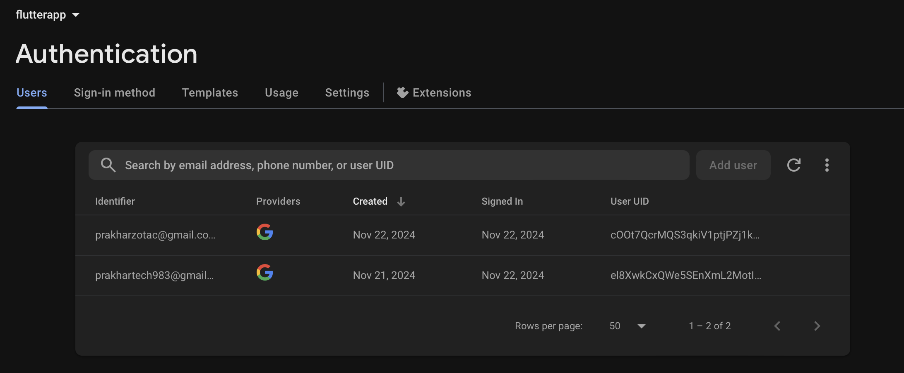

# Firebase Login with Phone & Google Authentication

This Flutter app demonstrates Firebase authentication using Google Sign-In and phone number verification. It includes a simple login page, navigates to the home page after successful login, and implements a profile tab with a "Win Certificate" feature.

## Features

- **Google Sign-In**: Users can log in with their Google account.
- **Phone Number Sign-In**: Users can sign in with their phone number using OTP.
- **Home Page**: After login, users are navigated to the home page.
- **Profile Tab**: Users can view their profile and attempt to win a certificate by answering a question within a limited time.
- **Certificate Feature**: A countdown timer with the "Win Certificate" page where users have 30 seconds to answer a question.

## Screenshots

<p align="center">
  
  
  
</p>

## Installation

1. Clone the repository:
   ```bash
   git clone https://github.com/PrakEntech/FlutterApp.git

	2.	Navigate into the project directory:

cd FlutterApp


	3.	Install dependencies:

flutter pub get


	4.	Run the app:

flutter run


Firebase Setup

	1.	Create a Firebase project.
	2.	Add Firebase Authentication to your Firebase project.
	3.	Enable Google Sign-In and Phone Authentication in the Firebase Console.
	4.	Download the google-services.json file and add it to your Flutter project at android/app/.

How to Use

	1.	Login with Google: Tap the “Sign in with Google” button on the login screen to authenticate with Google.
	2.	Login with Phone: Enter your phone number to receive an OTP for verification.
	3.	Home Page: After logging in, you will be directed to the HomePage.
	4.	Profile Tab: Navigate to the Profile tab to see your user profile and win a certificate by answering a question.
	5.	Win Certificate: After the timer starts, answer the question to win the certificate.

Code Overview

main.dart

	•	Initializes Firebase and runs the app.
	•	Navigates to LoginPage on app start.

login_page.dart

	•	Handles Google and Phone Sign-In.
	•	Google Sign-In is performed via the google_sign_in package.
	•	Phone number verification is handled by Firebase’s verifyPhoneNumber.

home_page.dart

	•	Displays a welcome message after successful login.
	•	Provides a “Logout” button that takes the user back to the LoginPage.

profile_tab.dart

	•	Displays user profile information.
	•	Includes a “Win Certificate” button that navigates to the WinCertificatePage.

win_certificate.dart

	•	Features a countdown timer (30 seconds).
	•	User has to answer a question within the time limit to “win a certificate.”

Dependencies

	•	firebase_auth: For Firebase authentication.
	•	google_sign_in: For Google sign-in functionality.
	•	firebase_core: For Firebase initialization in Flutter.

Firebase Configuration

	1.	Ensure Firebase is properly initialized in the project.
	2.	Enable Google Sign-In and Phone Authentication in Firebase.

Issues & Troubleshooting

	•	Ensure the correct Firebase configurations are in place (like google-services.json).
	•	Make sure to add your Android app’s SHA-1 fingerprint to Firebase for Google Sign-In.
